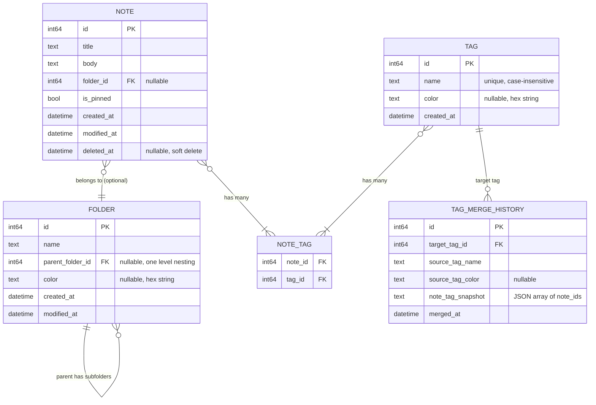

# feat: iOS Notez — Organization-First Notes App

## Overview

Build a native iOS notes app where **organization is the primary feature**. Users with large note collections get powerful folder, tag, and search tools to manage their notes. SwiftUI + GRDB (SQLite) with a repository pattern. iOS 17+ only, no cloud sync.

## Problem Statement

Existing notes apps focus on editing and formatting. Users with hundreds or thousands of notes lack the organizational tools they need — specifically: single-folder assignment with subfolder nesting, cross-cutting tags with merge/undo support, and complex boolean search queries. This app prioritizes the management layer over the editing layer.

## Technical Approach

### Architecture

```
┌─────────────────────────────────────────────────┐
│                    SwiftUI Views                 │
│  (NavigationStack, @Query, @Observable VMs)      │
├─────────────────────────────────────────────────┤
│                   View Models                    │
│  (@Observable, business logic, search parsing)   │
├─────────────────────────────────────────────────┤
│                  Repositories                    │
│  (Protocol-based, GRDB queries, observations)    │
├─────────────────────────────────────────────────┤
│                  GRDB + SQLite                   │
│  (Records, Associations, Migrations)             │
└─────────────────────────────────────────────────┘
```

**Key tech choices:**
- **SwiftUI** with `@Observable` (iOS 17+), `NavigationStack`
- **GRDB.swift v7+** with `GRDBQuery` for `@Query` property wrapper in SwiftUI
- **Repository pattern** — protocol-based, injectable, testable
- **Markdown storage** — body stored as Markdown source, rendered via `MarkdownUI` library for full syntax (headings, lists, code blocks)
- **Scanner-based search parser** — tokenizer + parser for prefix-based query syntax

### Dependencies (Swift Package Manager)

| Package | Purpose |
|---------|---------|
| [GRDB.swift](https://github.com/groue/GRDB.swift) | SQLite persistence, record mapping, observations |
| [GRDBQuery](https://github.com/groue/GRDBQuery) | `@Query` SwiftUI property wrapper for reactive database views |
| [MarkdownUI](https://github.com/gonzalezreal/swift-markdown-ui) | Full Markdown rendering in SwiftUI (headings, lists, code blocks) |

### Data Model (ERD)



### Edge Case Decisions (from SpecFlow Analysis)

These decisions resolve critical gaps identified during specification analysis:

#### Folder Deletion Behavior
- **Decision:** When a folder is deleted, all notes inside move to "Unsorted Notes" (folder_id set to NULL). Subfolders under a deleted parent become top-level folders. Confirmation dialog warns: "X notes will be moved to Unsorted Notes."
- **Rationale:** Safest option — never deletes user notes as a side effect.

#### Note Restoration from Trash
- **Decision:** Restored notes return to their original folder if it still exists. If the folder was deleted, the note goes to "Unsorted Notes". All attributes (pin state, tags, folder) are preserved in the database during soft-delete.
- **Rationale:** `deleted_at` is the only field changed on soft-delete; everything else stays intact.

#### Tag Merge Undo Mechanics
- **Decision:** Merge history stores the list of note_ids that had the source tag. On undo: recreate the source tag, re-assign it to notes in the snapshot that still exist (skip permanently deleted notes). Undo is additive — tags added to notes after the merge are kept. Chained merges (A→B, B→C) can be undone in reverse order only (LIFO).
- **Rationale:** Additive undo is safest. LIFO constraint prevents complex state corruption.

#### Tag Deletion
- **Decision:** Tag deletion is NOT undoable (unlike merge). Shows confirmation dialog: "This will remove the tag from X notes. This cannot be undone." For recoverable tag removal, users should merge into another tag instead.
- **Rationale:** Keeps the system simple. Merge-with-undo is the safe alternative.

#### Name Uniqueness
- **Decision:** Folder names are unique among siblings (two top-level folders can't share a name; two subfolders under the same parent can't share a name). Tag names are globally unique, case-insensitive. Enforced at the database level with UNIQUE constraints.
- **Rationale:** Required for unambiguous text search syntax (`folder:name`, `tag:name`).

#### Search Mode Conversion
- **Decision:** Switching from visual → text auto-generates the text query from current filter chips. Switching from text → visual attempts to parse and populate chips; if the query is too complex (nested parentheses), shows a warning "This query is too complex for visual mode" and stays in text mode.
- **Rationale:** Visual→text always works (visual is a subset). Text→visual is best-effort.

#### Text Search Syntax Details
- **Decision:** Names with spaces or special characters require double quotes: `folder:"My Work"`, `tag:"work-in-progress"`. Search is case-insensitive. Operators are case-insensitive (`and`/`AND`/`And` all work). Unrecognized prefixes are treated as full-text search terms.
- **Rationale:** Gmail/GitHub convention users are already familiar with.

#### Folder Counts
- **Decision:** Parent folder count includes notes in all subfolders (recursive count). Main page shows this aggregate count.
- **Rationale:** Users expect the number to represent "everything inside this folder."

#### Subfolder Display on Main Page
- **Decision:** Subfolders are shown nested (indented) under their parent folder on the main page. Parent folders are not collapsible — all subfolders are always visible.
- **Rationale:** With max one level of nesting, the list stays manageable. Collapsing adds complexity without much benefit.

#### Main Page Ordering
- **Decision:** Folders sorted alphabetically by name. Tags sorted alphabetically by name. Within both, counts are shown as badges.
- **Rationale:** Predictable ordering at scale. No need for user-configurable sort.

#### Trash Capabilities
- **Decision:** Trash is view-only. Users can see note titles and snippets, restore, or permanently delete. Cannot edit notes in trash. No auto-purge warning notifications (v1 — keep it simple).
- **Rationale:** Trash is for recovery, not editing. Notifications are v2.

#### Snippet Generation
- **Decision:** Strip Markdown syntax, take first 120 characters of plain text, replace newlines with spaces, trim trailing whitespace.
- **Rationale:** Consistent, predictable snippets that are readable.

#### Default Colors
- **Decision:** Folders and tags without a user-assigned color use the system accent color (`.accentColor`). Color picker offers 12 preset colors plus a custom picker.
- **Rationale:** System accent color integrates naturally with iOS theming.

---

## Implementation Phases

### Phase 1: Project Setup & Data Layer

Set up the Xcode project, database, and core data model. No UI yet — just the foundation.

#### Tasks

- [x] Create Xcode project (`ios-notez`, SwiftUI lifecycle, iOS 17+ target)
- [x] Add `.gitignore` for Xcode (xcuserdata, DerivedData, .DS_Store, etc.)
- [x] Add SPM dependencies: GRDB.swift, GRDBQuery, MarkdownUI
- [x] Create `Database/AppDatabase.swift` — database setup, singleton, migration runner
- [x] Create database migrations (v1 initial schema):
  - `folder` table with name, parent_folder_id, color, created_at, modified_at
  - `note` table with title, body, folder_id, is_pinned, created_at, modified_at, deleted_at
  - `tag` table with name (UNIQUE COLLATE NOCASE), color, created_at
  - `note_tag` join table with composite primary key
  - `tag_merge_history` table with target_tag_id, source_tag_name, source_tag_color, note_tag_snapshot, merged_at
  - Indexes on foreign keys and commonly queried columns
  - CHECK constraint: `parent_folder_id` references only folders where `parent_folder_id IS NULL` (enforce one-level nesting)
- [x] Create GRDB record types:
  - `Models/Note.swift` — `Codable, Identifiable, FetchableRecord, MutablePersistableRecord`
  - `Models/Folder.swift` — same protocols
  - `Models/Tag.swift` — same protocols
  - `Models/NoteTag.swift` — same protocols
  - `Models/TagMergeHistory.swift` — same protocols
- [x] Define GRDB associations:
  - `Note.folder` (belongsTo), `Note.tags` (hasMany through noteTags)
  - `Folder.notes` (hasMany), `Folder.parentFolder` (belongsTo), `Folder.childFolders` (hasMany)
  - `Tag.notes` (hasMany through noteTags)
- [x] Create repository protocols:
  - `Repositories/NoteRepository.swift` — CRUD, soft delete, restore, fetch by folder, fetch by tag, fetch pinned, fetch unsorted, search
  - `Repositories/FolderRepository.swift` — CRUD, fetch with note counts (recursive), fetch subfolders
  - `Repositories/TagRepository.swift` — CRUD, rename, merge, undo merge, fetch with note counts
- [x] Create GRDB-backed repository implementations:
  - `Repositories/GRDBNoteRepository.swift`
  - `Repositories/GRDBFolderRepository.swift`
  - `Repositories/GRDBTagRepository.swift`
- [x] Add soft-delete scopes to Note: `.notDeleted()`, `.deleted()`, `.trashedOlderThan(days:)`
- [x] Seed sample data for development (debug-only)

#### Files

```
ios-notez/
├── ios-notez.xcodeproj
├── .gitignore
├── ios-notez/
│   ├── ios_notezApp.swift
│   ├── ContentView.swift
│   ├── Database/
│   │   └── AppDatabase.swift
│   ├── Models/
│   │   ├── Note.swift
│   │   ├── Folder.swift
│   │   ├── Tag.swift
│   │   ├── NoteTag.swift
│   │   └── TagMergeHistory.swift
│   └── Repositories/
│       ├── NoteRepository.swift          (protocol)
│       ├── FolderRepository.swift        (protocol)
│       ├── TagRepository.swift           (protocol)
│       ├── GRDBNoteRepository.swift
│       ├── GRDBFolderRepository.swift
│       └── GRDBTagRepository.swift
```

---

### Phase 2: Main Page & Folder Navigation

Build the main page layout and folder/subfolder navigation.

#### Tasks

- [ ] Create `Views/MainPage/MainPageView.swift` — "Your notes" heading, sections for pinned, unsorted, folders, tags
- [ ] Create `Views/MainPage/VirtualFolderRow.swift` — row for "All Pinned Notes" and "Unsorted Notes" with count badge
- [ ] Create `Views/MainPage/FolderRow.swift` — folder name, color indicator, note count badge, indented subfolder rows
- [ ] Create `Views/MainPage/TagRow.swift` — tag name, color chip, note count badge
- [ ] Create `ViewModels/MainPageViewModel.swift` — `@Observable`, fetches counts for all sections using ValueObservation
- [ ] Create GRDBQuery requests:
  - `Requests/PinnedNotesCountRequest.swift`
  - `Requests/UnsortedNotesCountRequest.swift`
  - `Requests/FoldersWithCountsRequest.swift`
  - `Requests/TagsWithCountsRequest.swift`
- [ ] Create `Views/FolderView/FolderDetailView.swift` — list of notes in folder, pinned first, sorted by modified_at DESC
- [ ] Create `Views/FolderView/SubfolderSection.swift` — show subfolders at top of folder detail view
- [ ] Create `Views/TagView/TagDetailView.swift` — list of notes with tag, pinned first, sorted by modified_at DESC
- [ ] Create `Views/Shared/NoteRowView.swift` — title, snippet (configurable), tag chips, pin indicator, modified date
- [ ] Wire up `NavigationStack` with `.navigationDestination` for Folder and Tag
- [ ] Create empty state views: main page (no notes), folder (no notes in folder), tag (no notes with tag)
- [ ] Create `Views/Trash/TrashView.swift` — list trashed notes, restore/permanent delete actions

#### Files

```
ios-notez/
├── Views/
│   ├── MainPage/
│   │   ├── MainPageView.swift
│   │   ├── VirtualFolderRow.swift
│   │   ├── FolderRow.swift
│   │   └── TagRow.swift
│   ├── FolderView/
│   │   ├── FolderDetailView.swift
│   │   └── SubfolderSection.swift
│   ├── TagView/
│   │   └── TagDetailView.swift
│   ├── Trash/
│   │   └── TrashView.swift
│   └── Shared/
│       ├── NoteRowView.swift
│       └── EmptyStateView.swift
├── ViewModels/
│   └── MainPageViewModel.swift
└── Requests/
    ├── PinnedNotesCountRequest.swift
    ├── UnsortedNotesCountRequest.swift
    ├── FoldersWithCountsRequest.swift
    └── TagsWithCountsRequest.swift
```

---

### Phase 3: Note CRUD & Editor

Create, edit, view, and manage individual notes.

#### Tasks

- [ ] Create `Views/NoteEditor/NoteEditorView.swift` — title field, Markdown body editor with formatting toolbar
- [ ] Create `Views/NoteEditor/MarkdownToolbar.swift` — bold, italic, bullet list buttons. Each wraps/unwraps Markdown syntax around selection
- [ ] Create `Views/NoteEditor/NotePreviewView.swift` — renders Markdown body using MarkdownUI library
- [ ] Create `ViewModels/NoteEditorViewModel.swift` — `@Observable`, handles save (insert/update), auto-save on changes (debounced)
- [ ] Implement note creation flow: + button on main page and folder views → opens NoteEditorView with empty note
- [ ] Implement note editing flow: tap note row → opens NoteEditorView with existing note data
- [ ] Implement folder assignment: picker in note editor to select folder (or "None" for unsorted)
- [ ] Implement tag assignment: multi-select tag picker in note editor, option to create new tag inline
- [ ] Implement pin/unpin: toggle in note editor and swipe action on note rows
- [ ] Implement soft delete: swipe action on note rows → sets `deleted_at`, note moves to trash
- [ ] Implement restore from trash: button in TrashView → clears `deleted_at`, restores to original folder (or Unsorted if folder deleted)
- [ ] Implement permanent delete: button in TrashView → hard delete from database (CASCADE removes note_tags)
- [ ] Implement trash auto-purge: on app launch, delete notes where `deleted_at` < 30 days ago

#### Files

```
ios-notez/
├── Views/
│   └── NoteEditor/
│       ├── NoteEditorView.swift
│       ├── MarkdownToolbar.swift
│       └── NotePreviewView.swift
└── ViewModels/
    └── NoteEditorViewModel.swift
```

---

### Phase 4: Folder & Tag Management

CRUD for folders and tags, including merge with undo.

#### Tasks

- [ ] Create `Views/FolderManagement/CreateFolderSheet.swift` — name input, optional parent folder picker (only top-level folders), color picker
- [ ] Create `Views/FolderManagement/EditFolderSheet.swift` — rename, change color, delete with confirmation
- [ ] Create `Views/TagManagement/CreateTagSheet.swift` — name input, color picker
- [ ] Create `Views/TagManagement/EditTagSheet.swift` — rename, change color, delete with confirmation
- [ ] Create `Views/TagManagement/MergeTagsSheet.swift` — multi-select source tags, pick target tag, preview affected note count, confirm
- [ ] Create `Views/TagManagement/MergeHistoryView.swift` — list of past merges, undo button for each (LIFO order enforced)
- [ ] Implement folder deletion: confirmation dialog showing affected note count → moves notes to Unsorted, promotes subfolders to top-level
- [ ] Implement tag rename: update tag name → all note associations update automatically (same tag_id)
- [ ] Implement tag merge:
  1. Record snapshot: store list of note_ids that have the source tag(s) in `tag_merge_history`
  2. For each source tag: add target tag to all notes that have source tag (skip if already has target)
  3. Remove source tag from all notes
  4. Delete source tag records
- [ ] Implement tag merge undo:
  1. Validate: only allow undo of most recent merge for a given target tag (LIFO)
  2. Recreate source tag with original name and color
  3. Re-assign source tag to notes in snapshot that still exist and are not permanently deleted
  4. Remove target tag from those notes (only if it wasn't already there before the merge — need to track this)
  5. Delete the merge history record
- [ ] Create `Views/Shared/ColorPickerView.swift` — 12 preset colors + custom color picker
- [ ] Add context menu / swipe actions on folder and tag rows (edit, delete)

#### Files

```
ios-notez/
├── Views/
│   ├── FolderManagement/
│   │   ├── CreateFolderSheet.swift
│   │   └── EditFolderSheet.swift
│   ├── TagManagement/
│   │   ├── CreateTagSheet.swift
│   │   ├── EditTagSheet.swift
│   │   ├── MergeTagsSheet.swift
│   │   └── MergeHistoryView.swift
│   └── Shared/
│       └── ColorPickerView.swift
```

---

### Phase 5: Search System

Build the hybrid search with visual filter chips and text-based prefix syntax.

#### Tasks

- [ ] Create `Search/SearchQueryToken.swift` — enum: `.tag(String)`, `.folder(String)`, `.text(String)`, `.and`, `.or`, `.not`, `.openParen`, `.closeParen`
- [ ] Create `Search/SearchQueryTokenizer.swift` — Scanner-based tokenizer:
  - Recognizes: `tag:"quoted name"`, `tag:simplename`, `folder:name`, `AND`, `OR`, `NOT`, `(`, `)`
  - Case-insensitive operators
  - Unquoted words treated as full-text search terms
- [ ] Create `Search/SearchQueryParser.swift` — builds AST from tokens:
  - `SearchExpression` enum: `.tag(String)`, `.folder(String)`, `.text(String)`, `.and(SearchExpression, SearchExpression)`, `.or(SearchExpression, SearchExpression)`, `.not(SearchExpression)`, `.pinned(Bool)`
  - Respects operator precedence: NOT > AND > OR
  - Parentheses for grouping
- [ ] Create `Search/SearchQueryBuilder.swift` — converts `SearchExpression` AST to GRDB `QueryInterfaceRequest<Note>`:
  - Tag filters: JOIN note_tags → tags WHERE name matches
  - Folder filters: WHERE folder_id IN (SELECT id FROM folders WHERE name matches)
  - NOT folder: WHERE folder_id NOT IN (...)
  - Full text: WHERE title LIKE '%term%' OR body LIKE '%term%'
  - Combine with AND/OR using GRDB's `&&` and `||` operators
  - Always appends `AND deleted_at IS NULL`
  - Always applies `ORDER BY is_pinned DESC, modified_at DESC`
- [ ] Create `Search/SearchQuerySerializer.swift` — converts visual filter state back to text syntax (for visual→text mode switch)
- [ ] Create `Views/Search/SearchView.swift` — search bar, mode toggle (visual/text), results list
- [ ] Create `Views/Search/VisualFilterView.swift` — filter chip UI:
  - Tag chips with OR/AND toggle between them
  - Folder chips with include/exclude toggle
  - Pinned filter toggle
  - Add filter button (picks from available tags/folders)
- [ ] Create `Views/Search/TextSearchView.swift` — text input field, syntax error display (inline below field), auto-complete suggestions for tag/folder names
- [ ] Create `ViewModels/SearchViewModel.swift` — `@Observable`, holds filter state, parses queries, manages mode switching
- [ ] Create `Requests/SearchResultsRequest.swift` — GRDBQuery request that takes a `SearchExpression` and returns `[Note]`
- [ ] Implement mode switching:
  - Visual → Text: serialize filter state to query string
  - Text → Visual: attempt to parse and populate filter state; if too complex, show warning and stay in text mode
- [ ] Handle empty results: show "No notes match your search" with clear filters button
- [ ] Handle syntax errors: highlight error position, show message below search bar

#### Files

```
ios-notez/
├── Search/
│   ├── SearchQueryToken.swift
│   ├── SearchQueryTokenizer.swift
│   ├── SearchQueryParser.swift
│   ├── SearchQueryBuilder.swift
│   └── SearchQuerySerializer.swift
├── Views/
│   └── Search/
│       ├── SearchView.swift
│       ├── VisualFilterView.swift
│       └── TextSearchView.swift
├── ViewModels/
│   └── SearchViewModel.swift
└── Requests/
    └── SearchResultsRequest.swift
```

---

### Phase 6: Settings & Polish

User settings, empty states, and final polish.

#### Tasks

- [ ] Create `Views/Settings/SettingsView.swift` — toggle snippet display on/off, stored in UserDefaults
- [ ] Create `Utilities/UserSettings.swift` — `@Observable` wrapper around UserDefaults for settings
- [ ] Create `Utilities/SnippetGenerator.swift` — strips Markdown syntax, takes first 120 chars, replaces newlines with spaces
- [ ] Wire snippet toggle into `NoteRowView` — show/hide snippet based on setting
- [ ] Add Trash entry to main page (below tags section, with count of trashed notes)
- [ ] Add Settings gear icon to main page navigation bar
- [ ] Add search icon to main page navigation bar → opens SearchView
- [ ] Polish empty states for all views (main page, folders, tags, search, trash)
- [ ] Add haptic feedback on pin/unpin, delete, restore actions
- [ ] Add swipe actions on note rows: pin/unpin (leading), delete (trailing)
- [ ] Add context menus on note rows: edit, move to folder, pin/unpin, delete
- [ ] Add context menus on folder rows: edit, delete
- [ ] Add context menus on tag rows: edit, merge, delete
- [ ] Test with large datasets (1000+ notes, 50+ folders, 100+ tags) for performance

#### Files

```
ios-notez/
├── Views/
│   └── Settings/
│       └── SettingsView.swift
└── Utilities/
    ├── UserSettings.swift
    └── SnippetGenerator.swift
```

---

## Acceptance Criteria

### Functional Requirements

- [ ] User can create, edit, view, and delete notes with title and Markdown body
- [ ] User can create folders (one level of nesting), assign colors, rename, delete
- [ ] User can create tags, assign colors, rename, merge (with permanent undo), delete
- [ ] Notes can be assigned to one folder (or stay unsorted) and multiple tags
- [ ] Notes can be pinned/unpinned; pinned notes appear first in all list views
- [ ] Main page shows: All Pinned Notes, Unsorted Notes, folders (with subfolders), tags — all with counts
- [ ] Folder view shows notes in that folder, pinned first, sorted by modified_at
- [ ] Tag view shows notes with that tag, pinned first, sorted by modified_at
- [ ] Visual search builder with tag/folder filter chips and AND/OR/NOT logic
- [ ] Text search with prefix syntax: `tag:name`, `folder:name`, `AND`, `OR`, `NOT`, parentheses, quoted names
- [ ] Bidirectional search mode switching (visual ↔ text)
- [ ] Deleted notes go to trash, restorable, auto-purge after 30 days
- [ ] Folder deletion moves contained notes to Unsorted, promotes subfolders
- [ ] Tag merge records history; undo restores original tag assignments (LIFO)
- [ ] Configurable note list display (snippet on/off)

### Non-Functional Requirements

- [ ] App launches in under 1 second with 1000+ notes
- [ ] List scrolling stays at 60fps with 500+ notes in view
- [ ] Search query execution under 100ms for typical queries
- [ ] Database size stays reasonable (<50MB for 10,000 notes)

### Quality Gates

- [ ] All GRDB migrations run successfully on clean database
- [ ] Repository methods handle edge cases (nil folder, empty tags, duplicate names)
- [ ] Search parser handles malformed input gracefully (no crashes)
- [ ] Soft delete correctly excludes trashed notes from all non-trash views

---

## Dependencies & Prerequisites

- Xcode 15+ (for iOS 17 SDK)
- GRDB.swift v7+ (SPM)
- GRDBQuery (SPM)
- MarkdownUI (SPM)
- No backend or API dependencies
- No external accounts or services required

---

## Risk Analysis & Mitigation

| Risk | Likelihood | Impact | Mitigation |
|------|-----------|--------|------------|
| GRDB performance with complex search JOINs | Medium | High | Use indexes on all foreign keys and commonly filtered columns. Fall back to raw SQL for complex queries. Profile with 10k+ notes early. |
| Search parser edge cases | Medium | Medium | Build comprehensive test suite for tokenizer and parser. Handle malformed input gracefully with error recovery. |
| Tag merge undo state corruption | Low | High | LIFO constraint simplifies undo. Store complete snapshots. Validate state before undo. |
| Markdown toolbar UX complexity | Medium | Low | Keep toolbar minimal (3 buttons). Defer complex formatting to v2. |
| MarkdownUI rendering performance with long notes | Low | Medium | Lazy render only visible content. Test with large Markdown documents. |

---

## Future Considerations (v2+)

- Cloud sync (iCloud/CloudKit)
- Full-text search using SQLite FTS5
- Image/file attachments
- Saved search queries
- Widget support
- Siri/Shortcuts integration
- iPad multi-column layout
- Export/import (JSON, Markdown files)
- Auto-purge warning notifications
- User-configurable sort options
- Collapsible folder sections on main page

---

## References & Research

### Internal References
- Brainstorm document: `docs/brainstorms/2026-02-15-ios-notez-brainstorm.md`

### External References
- [GRDB.swift Documentation](https://github.com/groue/GRDB.swift)
- [GRDBQuery for SwiftUI](https://github.com/groue/GRDBQuery)
- [GRDB Associations Guide](https://github.com/groue/GRDB.swift/blob/master/Documentation/AssociationsBasics.md)
- [GRDB ValueObservation](https://github.com/groue/GRDB.swift/blob/master/GRDB/Documentation.docc/Extension/ValueObservation.md)
- [GRDB7 Migration Guide (MainActor defaults)](https://github.com/groue/GRDB.swift/blob/master/Documentation/GRDB7MigrationGuide.md)
- [MarkdownUI Library](https://github.com/gonzalezreal/swift-markdown-ui)
- [@Observable in SwiftUI (Donny Wals)](https://www.donnywals.com/observable-in-swiftui-explained/)
- [Repository Pattern in Swift (SwiftLee)](https://www.avanderlee.com/swift/repository-design-pattern/)
- [String Parsing in Swift (Swift by Sundell)](https://www.swiftbysundell.com/articles/string-parsing-in-swift/)
